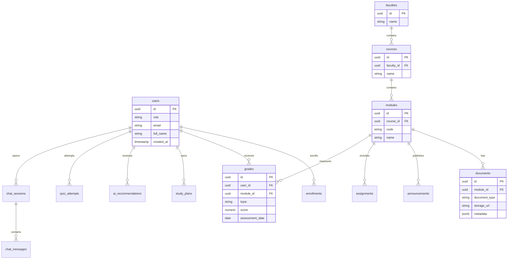

# Database Schema Diagram

```mermaid
erDiagram
  users ||--o{ enrollments : enrolls
  faculties ||--o{ courses : contains
  courses ||--o{ modules : contains
  modules ||--o{ documents : has
  modules ||--o{ announcements : publishes
  modules ||--o{ assignments : includes
  users ||--o{ grades : receives
  modules ||--o{ grades : measures
  users ||--o{ study_plans : owns
  users ||--o{ ai_recommendations : receives
  users ||--o{ quiz_attempts : attempts
  users ||--o{ chat_sessions : opens
  chat_sessions ||--o{ chat_messages : contains

  users {
    uuid id PK
    string role
    string email
    string full_name
    timestamp created_at
  }
  faculties {
    uuid id PK
    string name
  }
  courses {
    uuid id PK
    uuid faculty_id FK
    string name
  }
  modules {
    uuid id PK
    uuid course_id FK
    string code
    string name
  }
  documents {
    uuid id PK
    uuid module_id FK
    string document_type
    string storage_url
    jsonb metadata
  }
  grades {
    uuid id PK
    uuid user_id FK
    uuid module_id FK
    string topic
    numeric score
    date assessment_date
  }
```

Detailed SQL is available in `docs/database_schema.sql`.
